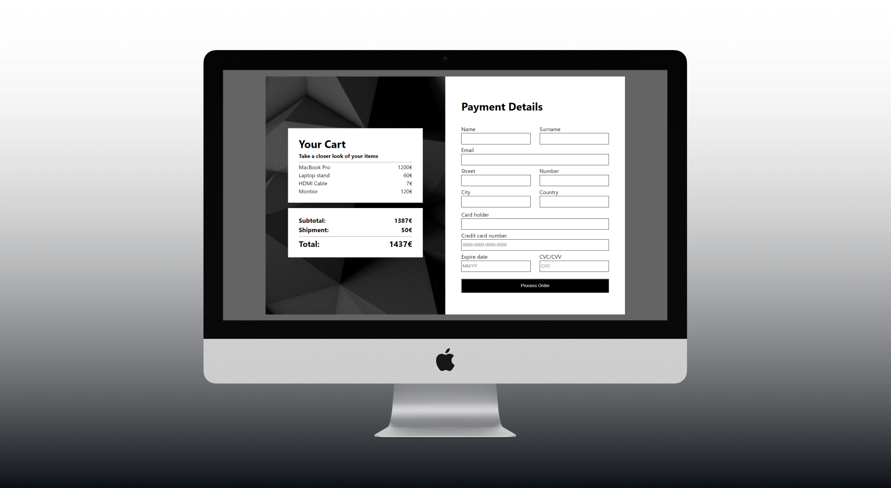

# React Shopping Cart With Payment

This GitHub project simulates a shopping cart using React components to display items fetched from a JSON file. TypeScript is utilized for type safety and enhanced development experience. Users are required to input personal data such as name, surname, credit card information, etc. The entered data undergoes validation before proceeding with the purchase.

## Live Demo

The project has been successfully deployed and is accessible via the following link: [React Shopping Cart](https://vermillion-platypus-bb8ccd.netlify.app/)

## Overview

The project focuses on creating a dynamic shopping cart experience using React components. Items are fetched from a JSON file and displayed in a user-friendly interface. TypeScript ensures type safety throughout the development process, reducing potential runtime errors and enhancing the overall development experience.

## Features

- **Dynamic Shopping Cart:** Utilizing React components, the project offers a dynamic shopping cart experience where users can view and interact with items in real-time.
- **Type Safety with TypeScript:** TypeScript is used to provide type safety, allowing for better code quality and error detection during development.
- **Personal Data Input:** Users are prompted to input personal data such as name, surname, and credit card information before proceeding with the purchase.
- **Data Validation:** The entered personal data undergoes validation to ensure its accuracy and completeness before finalizing the purchase.

## Usage

Feel free to explore the shopping cart functionality and provide feedback or contributions to enhance the project further.

